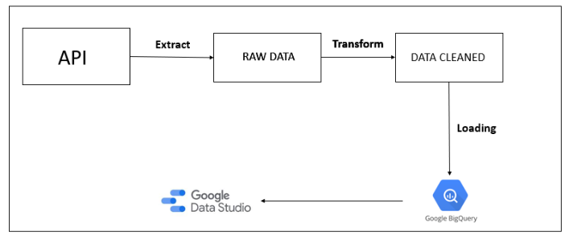
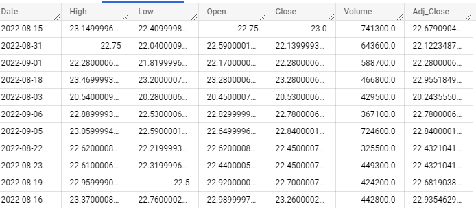
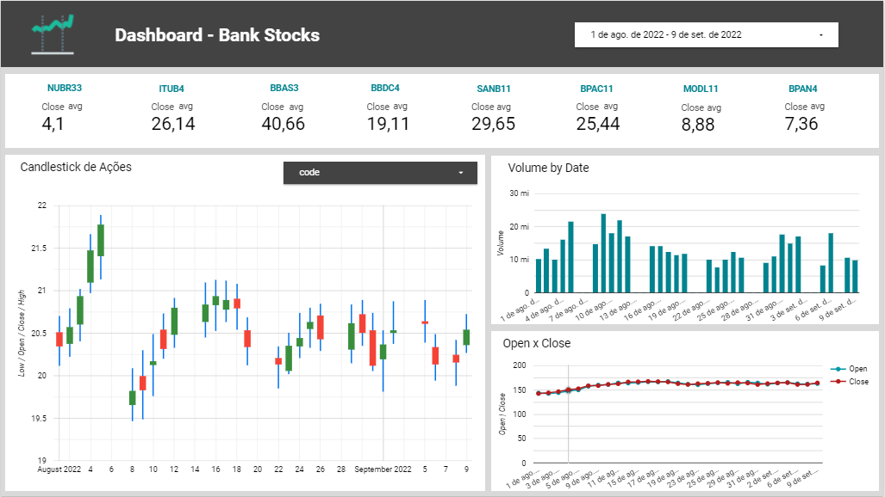
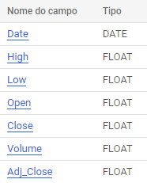

   

# Etl-Bank-Stocks

ETL com dados de ações de bancos usando Google Big Query e Data Studio.

  

# Ferramentas e Tecnologias

- Python
- Vs code
- Google Big Query
- Google Data Studio

# Arquitetura do ETL

Como API, é usado a biblioteca pandas_datareader que coleta dados de acões diárias. Os dados são transformados e carregados no Google Big Query e alimenta um Dashboard no Google Data Studio.

  

# Dados

Dados coletados da API do pandas_datareader:

  

# Visualização de Dados

Para acessar o link do Dashboard no Data Studio, clique [aqui](https://datastudio.google.com/reporting/7a8e4f96-7063-456b-9b37-ce0a0ae4d76c).

  

# Reutilzação

Para rodar o projeto em sua máquina, siga os passos abaixo:

1. Criar uma conta Google Cloud (pode ser free).
2. Criar um projeto e schema/dataset no Google Big Query
3. Criar uma tabela, conforma abaixo:

  

4. Criar um usuario para seu projeto e gerar.
5. Gerar as chaves de acesso deste usuario. O Big Query retorna um arquivo json.
6. Na chamada das funções, altere o project_id, schema, table e o arquivo json (credentials.json) para os seus dados.

# Versões Futuras

Adcionar o Airflow para fazer o agendamento dos Jobs.
